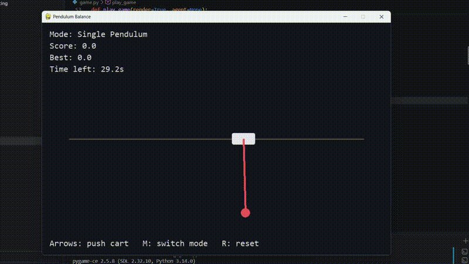

# 🧠 Inverted Pendulum AI

An AI project that learns to balance an inverted pendulum using **neuroevolution**. The project implements both a simple evolutionary approach and the **NEAT (NeuroEvolution of Augmenting Topologies)** algorithm.

## Example

## 🚀 Overview

The AI starts with a population of randomly initialized neural networks and improves them over multiple generations by selecting and evolving the best-performing agents.

The goal is simple: **keep the inverted pendulum balanced for as long as possible.**

### Algorithms

* **Simple Neuroevolution** — evolves neural network weights through selection, mutation, and reproduction.
* **NEAT** — evolves both neural network weights and topology, allowing increasingly complex networks to emerge over generations.

## 🎮 Environment

The pendulum is simulated using **Pygame**. Each agent receives information about the current state of the pendulum and outputs an action to control it.

The agent learns through a fitness function based on how long it can keep the pendulum balanced.

## 🎯 Goal

This project was created to explore how neural networks can learn control tasks through **evolution rather than traditional gradient-based training**.
