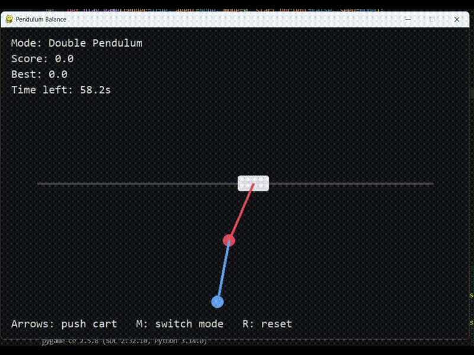
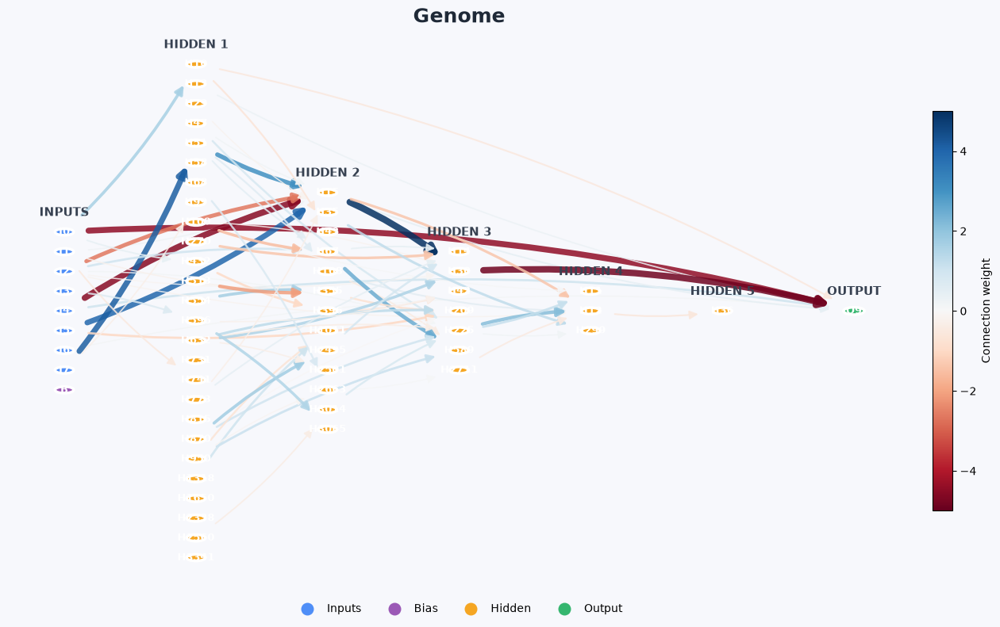
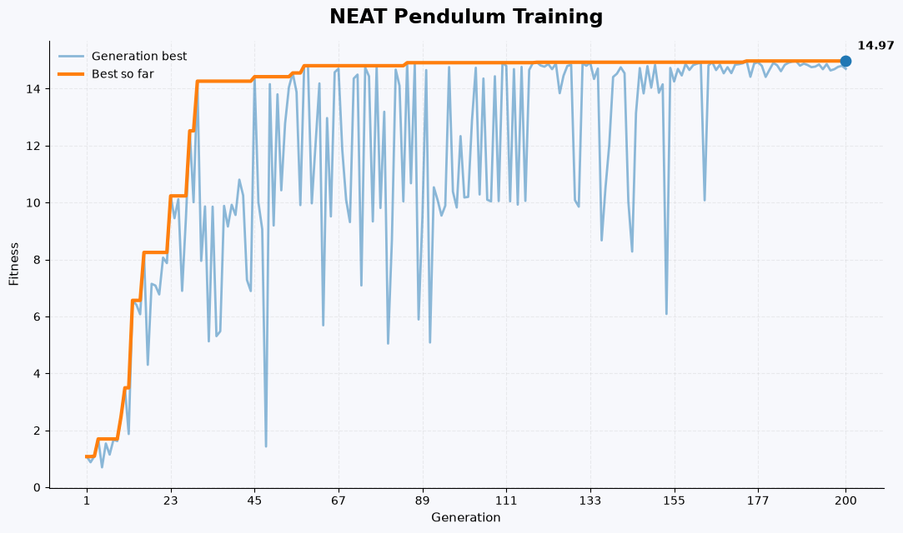

# 🧠 Inverted Pendulum AI

An AI project that learns to balance an inverted pendulum using **neuroevolution**. The project implements both a simple evolutionary approach and the **NEAT (NeuroEvolution of Augmenting Topologies)** algorithm.

## Example

## Double Pendulum

## Single Pendulum

## 🚀 Overview

The AI starts with a population of randomly initialized neural networks and improves them over multiple generations by selecting and evolving the best-performing agents.

The goal is simple: **keep the inverted pendulum balanced for as long as possible.**

### Algorithms

* **Simple Neuroevolution** — evolves neural network weights through selection, mutation, and reproduction.
Implementation can be found under the neuroevolution folder
* **NEAT** — NEAT (NeuroEvolution of Augmenting Topologies) is an evolutionary algorithm that evolves neural networks by optimizing both their connection weights and network structure. Starting with simple networks, NEAT gradually introduces new connections and nodes through mutation while selecting the best-performing networks over multiple generations. This allows the neural network to automatically evolve a suitable architecture and behavior for the given task.
Implementation of the neat algorithm can be found under the neat folder.

### Training Process

#### Single Pendulum

The single pendulum was a relatively easy task for both **Neuroevolution** and **NEAT**. Both algorithms achieved near-perfect results within 200 generations. However, the network produced by NEAT was significantly smaller while achieving comparable performance.

The behavior of both algorithms can be easily tuned by modifying the fitness function to prioritize different properties, such as the cart's **position, velocity, or acceleration**.

#### Double Pendulum

The double pendulum was significantly more challenging for both algorithms. The standard Neuroevolution approach was unable to achieve satisfactory results, while **NEAT was able to achieve a successful solution** with a specially tuned training procedure.

#### Modified Training Objective

Balancing a double pendulum with equal masses and equal rod lengths proved to be a particularly difficult task. To make the training process more effective, several modifications were introduced to the training objective:

* **Parallel execution** - Genome evaluations were run in parallel to significantly reduce training time.

* **Multiple episodes with randomized starting positions** - Each genome was evaluated across multiple episodes starting from an upright position with a small amount of noise added to the initial state. Since the randomized starting conditions produced noisy fitness values, multiple episodes were used and their results were averaged.

* **Training from both upright and downward positions** - Each generation included several episodes starting from the upright position and one episode starting from the downward position. Multiple runs were unnecessary for the downward position because its initial state was deterministic. The results were combined using a weighted average. This helped prevent the network from overfitting to the upright starting position and encouraged it to learn how to recover and balance the pendulum after bringing it upright from the downward position.

* **Early termination** - Episodes starting from the upright position were terminated as soon as the pendulum deviated significantly from the upright position. This substantially reduced training time while also providing a stronger incentive for the network to keep the rods upright.

* **Gradually reducing the mass difference** - Balancing the double pendulum becomes easier when the lower rod is heavier than the upper rod. NEAT was initially trained with a significant mass difference between the two rods. Once the network learned to balance under these conditions, the difference between the masses was gradually reduced, making the task progressively more difficult.

* **Gradually increasing gravity** - Balancing a double pendulum is easier under reduced gravity. Similar to the mass adjustment, the network was initially trained under low gravity, which was then gradually increased as the network improved.

The final successful solution was achieved after **more than 1,500 generations**, using different combinations of rod masses and gravity values throughout the training process.

The resulting network is capable of keeping both rods upright even when a **small disturbance (nudge)** is applied to either pendulum.

## Training Results

### Double Pendulum Solution

The best solution found for the double pendulum case is shown in the image below.

### Training Progress

The training progress and fitness evolution over the generations are shown in the plot below.

## 🎮 Environment

The pendulum is simulated using **Pygame**. Each agent receives information about the current state of the pendulum and outputs an action to control it.

The agent learns through a fitness function based on how long it can keep the pendulum balanced.

## 🎯 Goal

This project was created to explore how neural networks can learn control tasks through **evolution rather than traditional gradient-based training**.
